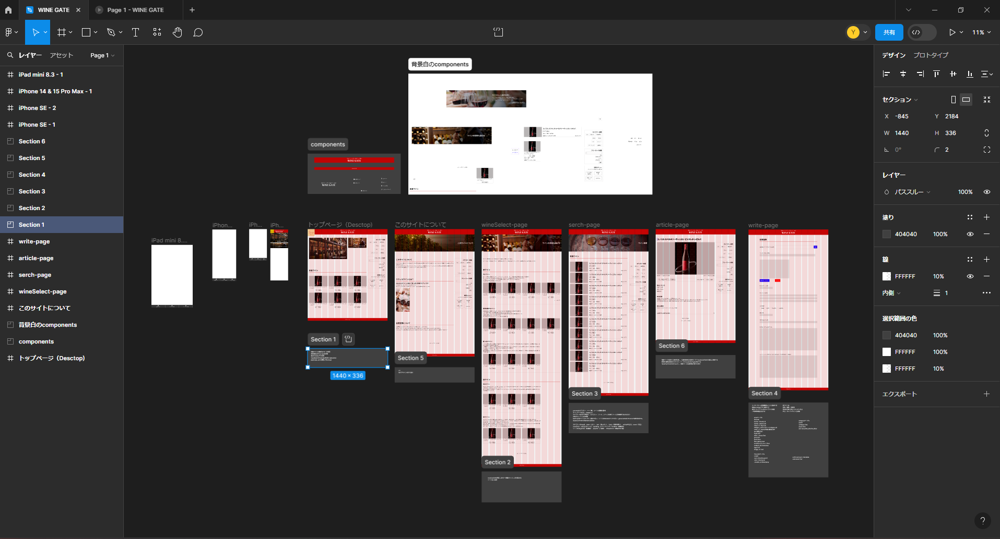
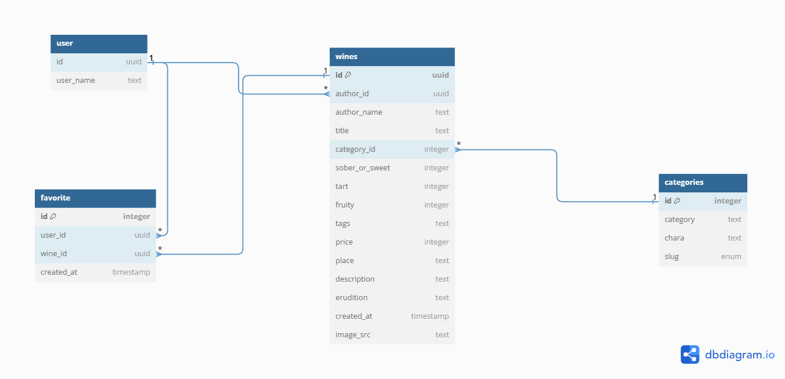

# WINE GATE

## 日本語で気軽にワインを探せる初心者と初心者にワインを布教したい人向けのワインコミュニティサイト

ワインを飲む人が減っているニュースを見て、少しでもカジュアルにワインを楽しめるサイトを作り間口を広げていければと思い制作しました。  
出来るだけ専門性を減らし一目でそのワインの特長を誰にでも分かりやすくする事で気軽にワインを楽しんでもらおうというコンセプトです。  
ログインすると自分でも記事投稿が出来る為、ワインの布教ツールとしても使っていただけます。  
お気に入り機能もある為、自分だけのワインサイトを作る事もできます。

マネタイズを想定していない今までのサイトと異なり、このサイトは今後Amazonアフィリエイトや通販会社とのスポンサー契約でのマネタイズを前提にデザイン、  
機能設計、技術選定等を行いました。  
その為、中々のアプリケーションに仕上がりましたが月額費用等を考えると仕事を見つけてからでないと本番運用は難しそうです。

### 使用技術

- フロントエンド
  フレームワークはNext.js(App Router)を使用、CSSはTailwind CSSとUIライブラリにMantine UIを採用しています。  
  状態管理にはクライアントサイドにzustand、非同期処理周りにtanstack/queryを採用しています。
  App Routerはcache-control等のheaderの書き換えを許可しない上、edge runtimeを使用すると静的生成が出来ない問題がありキャッシュ周りにかなり苦戦しています。  
  当面はedge runtimeを中心にしようしつつもPPRがstableになり次第、個別ページや「ワインの選び方」ページ等はPPRにシフトしていく予定です。

- バックエンド
  supabaseを採用。  
  当初はNest.jsを採用し、バックエンドも出来る所を魅せるポートフォリオに仕上げる予定でしたが、今回のアプリケーションはマネタイズを目指しており転職活動終了以降も継続的に保守運用する必要があること、  
  今回ユーザー投稿の画像を保存及び処理する必要がある事、  
  現時点での私のインフラ知識ではそこまでのインフラ環境を整える事に不安があった事等から今回は見送りsupabaseを採用しました。  
  supabaseには画像処理APIもある為、将来的にはsupabase側で画像処理を行い画像の通信をsupabase→クライアントサイドとすることでVercel←→supabase間のトラフィックを抑制していく予定です。  
  日本語検索にはPostgreSQL拡張のPGroongaを採用。

- インフラ
  背伸びせず今回もVercelを使用予定

- テスト
  スタイルガイドにStorybookを使用、テストフレームワークはJestを使用予定。  
  Vitestを使ってみたかったのですが、Next.js上でTailwind CSSを使う場合PostcssがcommonJSでの動作になってしまいVitestを動作させることが叶わなかったのでいつも通りJestを使用。  
  テスト戦略として、今回コンポーネント設計をatomic designを意識して行い、templatesレイヤー以下でスタイルガイドの作成とJestで単体テストと結合テスト、pagesレイヤー以上はplaywrightに任せる事にしました。  
  海外の記事を見てもRSCのテスト戦略は非同期処理を行うレイヤーとそれを受け取るレイヤーでコンテナを分ける実装が主張されていた為、これが一番安パイだと考えました。

### デザイン

デザインも3度目となるとFigmaと少し仲良くなれた感じがします。  
配色イメージは[ワイン王国](https://www.winekingdom.co.jp/)様を参考にさせていただきました。  
今回はgridレイアウトを意識して全体のレイアウトを決めており、初めての2カラムレイアウトだったのですが、  
gridレイアウトとTailwind CSSとの相性があまり良くなく、シンプルな見た目に反してCSSはかなり苦戦しました。  
機能設計もFigmaの中で行っており、デザインを作りながら機能を考えていくやり方は実際に使用しているシーンをイメージ出来てその後のDBの設計もスムーズに進める事が出来ました。  
:hasや:not等の新しいCSSの機能も存分に活用できたので、苦労しながらも中々良い経験になりました。

### ER図

userはsupabase authのテーブルをそのまま流用の為簡易的に記載しています。  
データベース設計は初めてですが、一応第三正規系まで正規化しています。  
ただし、winesテーブルのtagsがMantine UIのTagsInputの仕様で複数入力の内容が一つの文字列として結合してFormDataに渡される所については扱いに大分悩みました。  
ユーザーの自由入力欄であり、このカラムでソートする事はないであろうことと分割してsupabaseに送るとなると少し処理が複雑化する事から、一つの文字列としてデータベースに登録し、クライアントサイドで分割する仕様に決定。  
この場合でも別テーブルにするべきだったのか、データベースのプロの意見も聞きたい所です。

### 今後

このサイトはインフラではなく内部実装を変更していく事でスケーリングに対応していく設計の為、このサイトは保守性が命です。  
その為、しばらくはリファクタリングや不足しているテストの追加、E2EテストやVRTの追加等を中心に保守性を改善していくのが当面の計画です。
また、細かいインタラクション制御についても詰めていければと思っています。  
その後はまだ未実装のLPデザインに着手し、本番環境に進めていきたいです。
